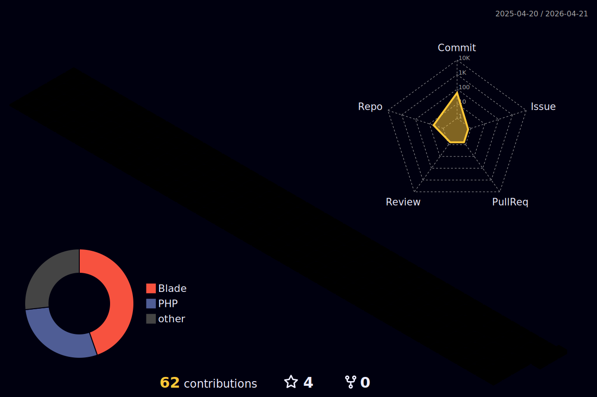

# Hi there! I'm Göknur 👋

### 🚀 About Me
I am a passionate **Full-Stack Developer** based in Nevşehir, Turkey. I focus on building scalable web applications and exploring the open-source ecosystem.

- 🏗️ Currently focusing on **Laravel-based** web projects.
- 🌱 Deepening my expertise in **PHP**, **Java**, **C#**, **JavaScript**, **HTML**, and **CSS**.
- 🔭 Constantly building projects to expand my portfolio on GitHub.

---

### 🛠️ Tech Stack & Skills

**Languages & Backend**

  
  
  
  

**Frontend**

  
  
  

---

### 📊 GitHub Statistics

  

  

---

### 🏙️ GitHub City (3D Contributions)

  

---

### 📫 Let's Connect
- **GitHub:** [goknurbaris](https://github.com/goknurbaris)
- **Location:** Nevşehir, Turkey
